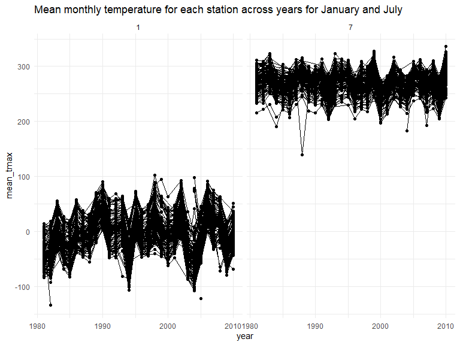
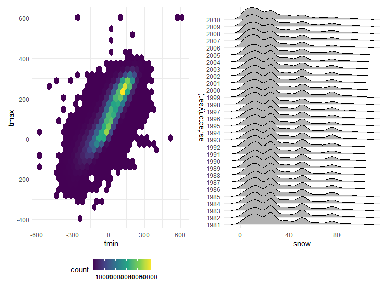
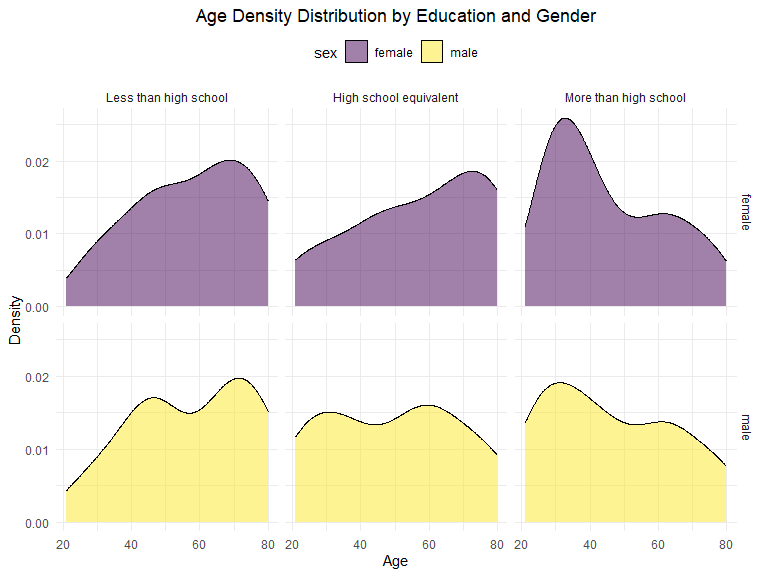
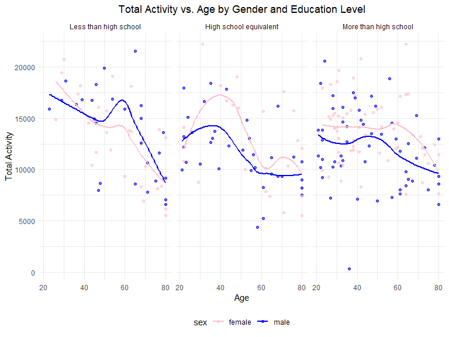
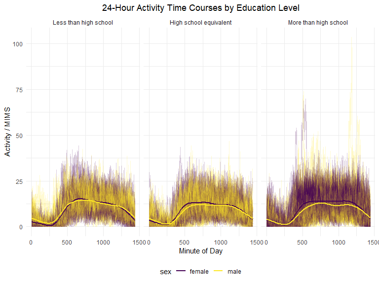
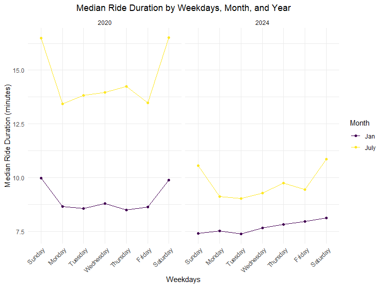
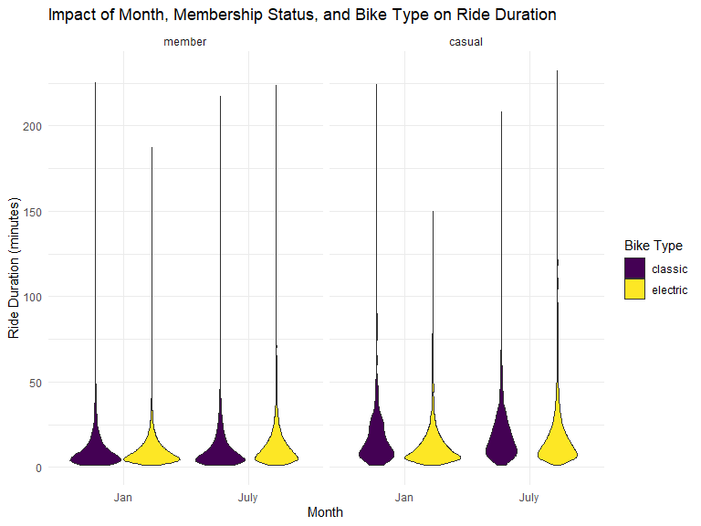

p8105_hw3_xl3495
================
Xueting Li
2024-10-14

# Problem 1

Load the dataset.

``` r
data("ny_noaa")
```

``` r
row = nrow(ny_noaa)
col = ncol(ny_noaa)
```

The `ny_noaa` dataset has 2595176 rows and 7 columns, containing 7
variables in total. Variables:  
`id`: weather station id  
`date`: date of observation  
`prcp`: precipitation (tenths of mm)  
`snow`: snowfall (mm) `snwd`: snow depth (mm) `tmax` and `tmin`: maximum
and minimum of temperature (tenths of degrees C)

Below are some explorations. I extracted year from date variable into a
new `chr` variable named `year`. Grouping by weather station id and
year, I calculated average precipitation(mm) and snow fall(mm) for each
year observed by each station. Then, I got the maximum annual mean
precipitation and maximum annual mean snow fall recorded by each station
through year 1980-2010.

``` r
df_1 = ny_noaa |>
  filter((!is.na(prcp)) & (!is.na(snow))) |>
  mutate(year = format(date, "%Y")) |>
  group_by(id, year) |>
  summarise(avg_prcp = mean(prcp),
            avg_snow = mean(snow))
```

    ## `summarise()` has grouped output by 'id'. You can override using the `.groups`
    ## argument.

``` r
max_avg_prcp = max(df_1 |>
                     pull(avg_prcp))
max_avg_snow = max(df_1 |>
                     pull(avg_snow))
```

## Answers

Below we clean the data, creating separate variables for year, month,
and day and converting `tmax` and `tmin` to numeric. We find that 0 is
the most commonly observed value for snowfall. This is because most days
of the year, it does not snow at all in NY. The second most commonly
observed value is `NA`, indicating missingness. Other common values are
13, 25, and 51, suggesting that snowfall is originally recorded in
fractions of an inch and converted to mm.

``` r
ny_noaa %>% 
  count(snow) %>%
  arrange(desc(n))
```

    ## # A tibble: 282 × 2
    ##     snow       n
    ##    <int>   <int>
    ##  1     0 2008508
    ##  2    NA  381221
    ##  3    25   31022
    ##  4    13   23095
    ##  5    51   18274
    ##  6    76   10173
    ##  7     8    9962
    ##  8     5    9748
    ##  9    38    9197
    ## 10     3    8790
    ## # ℹ 272 more rows

``` r
ny_noaa = 
  ny_noaa %>% 
  separate(date, into = c("year", "month", "day"), convert = TRUE) %>% 
  mutate(
    tmax = as.numeric(tmax),
    tmin = as.numeric(tmin))
```

Below is a two-panel plot showing the average max temperature in January
and in July in each station across years. As expected, the mean
temperature in January is much lower than the mean temperature in July
for all stations and across all years. All stations appear to follow
similar trends of temperature peaks and valleys within a month across
the years, i.e. when one station has a high monthly mean temperature for
a given year, most other stations also have a high monthly mean
temperature for that year. We do see one uncharacteristically cold
station in July of 1987 or 1988, as well as a few other less drastic
outliers.

``` r
ny_noaa %>% 
  group_by(id, year, month) %>% 
  filter(month %in% c(1, 7)) %>% 
  summarize(mean_tmax = mean(tmax, na.rm = TRUE, color = id)) %>% 
  ggplot(aes(x = year, y = mean_tmax, group = id)) + geom_point() + geom_path() +
  facet_grid(~month) +
  labs(title = "Mean monthly temperature for each station across years for January and July")
```

    ## `summarise()` has grouped output by 'id', 'year'. You can override using the
    ## `.groups` argument.



Below we show a two-panel plot including (i) a hex plot of `tmax` vs
`tmin` for the full dataset; and (ii) a ridge plot showing the
distribution of snowfall values (in mm) greater than 0 and less than 100
separately by year.

From the hex plot we see that while there is some variability, the
majority of the data cluster tightly in the center of the distribution.
In relatively rare cases, it seems that `tmax` is less than `tmin`,
which raises questions about data recording and quality.

From the ridge plot, we see a multimodal density of snowfall within a
given year. Most stations see between 0 and 35 mm of snow in a year.
Then there is a another group of stations that see about 45 mm of snow,
and another group that sees nearly 80 mm. It is likely this
multimodality stems from the conversion of measurements in one system
(fractions of an inch) to another (using the metric system), which was
also noted in the table of common values.

``` r
hex = 
  ny_noaa %>% 
  ggplot(aes(x = tmin, y = tmax)) + 
  geom_hex()

ridge = 
  ny_noaa %>% 
  filter(snow < 100, snow > 0) %>%
  ggplot(aes(x = snow, y = as.factor(year))) + 
  geom_density_ridges()

hex + ridge
```

    ## Picking joint bandwidth of 3.76



# Problem 2

## Read the data

``` r
covar_data = read_csv(
  file = "datasets/nhanes_covar.csv",
  skip = 4,
  na = c("NA")
)
```

    ## Rows: 250 Columns: 5
    ## ── Column specification ────────────────────────────────────────────────────────
    ## Delimiter: ","
    ## dbl (5): SEQN, sex, age, BMI, education
    ## 
    ## ℹ Use `spec()` to retrieve the full column specification for this data.
    ## ℹ Specify the column types or set `show_col_types = FALSE` to quiet this message.

``` r
accel_data = read_csv(
  file = "datasets/nhanes_accel.csv"
)
```

    ## Rows: 250 Columns: 1441
    ## ── Column specification ────────────────────────────────────────────────────────
    ## Delimiter: ","
    ## dbl (1441): SEQN, min1, min2, min3, min4, min5, min6, min7, min8, min9, min1...
    ## 
    ## ℹ Use `spec()` to retrieve the full column specification for this data.
    ## ℹ Specify the column types or set `show_col_types = FALSE` to quiet this message.

## Clean the data

``` r
covar_data = covar_data |>
  janitor::clean_names() |>
  filter(age >= 21) |>
  drop_na() |>
  mutate(
    sex = case_match(
      sex,
      1 ~ "male",
      2 ~ "female"
    ),
    education = case_match(
      education,
      1 ~ "Less than high school",
      2 ~ "High school equivalent",
      3 ~ "More than high school"
    )
  ) |>
  mutate(
    sex = factor(sex),
    education = factor(education, ordered = TRUE),
    education = fct_relevel(education, "Less than high school", "High school equivalent", "More than high school")
    )
  
accel_data = accel_data |>
  janitor::clean_names() |>
  pivot_longer(
    cols = min1:min1440,
    names_to = "time",
    values_to = "mims"
    )

combined_df = left_join(covar_data, accel_data, by = "seqn")
head(combined_df)
```

    ## # A tibble: 6 × 7
    ##    seqn sex     age   bmi education              time   mims
    ##   <dbl> <fct> <dbl> <dbl> <ord>                  <chr> <dbl>
    ## 1 62161 male     22  23.3 High school equivalent min1  1.11 
    ## 2 62161 male     22  23.3 High school equivalent min2  3.12 
    ## 3 62161 male     22  23.3 High school equivalent min3  1.47 
    ## 4 62161 male     22  23.3 High school equivalent min4  0.938
    ## 5 62161 male     22  23.3 High school equivalent min5  1.60 
    ## 6 62161 male     22  23.3 High school equivalent min6  0.145

## Table of Number of Men and Women in each Education Category

``` r
edu_data = combined_df |>
  group_by(sex, education) |>
  summarise(
    count = n()
  ) |>
  pivot_wider(
    names_from = sex, values_from = count
    )
```

    ## `summarise()` has grouped output by 'sex'. You can override using the `.groups`
    ## argument.

``` r
edu_tbl = kable(edu_data)
edu_tbl
```

| education              | female |  male |
|:-----------------------|-------:|------:|
| Less than high school  |  40320 | 38880 |
| High school equivalent |  33120 | 50400 |
| More than high school  |  84960 | 80640 |

This table contains information of number of men and women in each
education category. To read and understand easily, I used three levels
to interpret education levels:  
`More than high school`;  
`Less than high school`;  
`High school equivalent`.  
According to the table, there are 84960 female and 80640 male whose
education level is more than high school; 40320 female and 38880 male
whose education level is less than high school; 33120 female and 50400
male whose education level is high school equivalent. It was found that
around half (most) participants in this research got high education.
Though there are more female than male who got high education, it can
also be found that there are still a lot of female who got low
education, while that’s a relatively small proportion in male.

## Age Distribution by Education and Gender

``` r
age_dist_df = combined_df |>
  select(seqn, sex, age, education) |>
  group_by(seqn) |>
  distinct()

ggplot(age_dist_df, aes(x = age, fill = sex)) +
  geom_density(alpha = 0.5) +
  facet_grid(sex ~ education) +
  labs(title = "Age Density Distribution by Education and Gender",
       x = "Age",
       y = "Density") +
  theme_minimal() +
  theme(legend.position = "top") +
  theme(plot.title = element_text(hjust = 0.5))
```


Above is the density plot for age distribution by education and gender.
According to the plot, among those who have a education level of less
than high school, ages of both females and males are distributed around
70 years old, there is also a small concentration around 45 years old
among males. The age distribution of females who are high school
equivalent shows that the older you get, the more people you have; the
age distribution of males who are high school equivalent performs a
slight fluctuation trend. Females whose education are more than high
school are largely distributed around 34 years old, and males are mostly
distributed around 30 years old. The overall distribution shows the
young often get higher education than the old.

## Total Activity vs. Age by Gender and Education Level

``` r
total_activity_df = combined_df |>
  group_by(seqn) |>
  mutate(
    total_activity = sum(mims)
  ) |>
  select(seqn, sex, age, education, total_activity) |>
  distinct()

ggplot(total_activity_df, aes(x = age, y = total_activity, color = sex)) +
  geom_point(alpha = 0.6) +
  scale_color_manual(values = c("male" = "blue", "female" = "pink")) +
  geom_smooth(se = FALSE) +
  facet_grid(. ~ education) +
  labs(title = "Total Activity vs. Age by Gender and Education Level",
       x = "Age",
       y = "Total Activity") +
  theme_minimal() +
  theme(legend.position = "bottom") +
  theme(plot.title = element_text(hjust = 0.5))
```

    ## `geom_smooth()` using method = 'loess' and formula = 'y ~ x'


Above is the scatter plot with a trend line of total activity against
age and sex. The trend lines in the three plots though showing some
waves, they all illustrate the young has a higher total activity amount
than the old, no matter the sex. What’s more, males have more total
activity than females with education level of less than high school,
things are converse for the rest two education levels.

## 24-Hour Activity Time Courses by Education Level

``` r
track_activity_df = combined_df |>
  mutate(
    time = as.numeric(gsub("min", "", time))
  )

ggplot(track_activity_df, aes(x = time, y = mims, color = sex)) +
  geom_line(alpha = 0.2, aes(group = seqn)) +
  geom_smooth(aes(group = sex), se = FALSE) +
  labs(title = "24-Hour Activity Time Courses by Education Level",
       x = "Minute of Day",
       y = "Activity / MIMS") +
  facet_grid(.~education) +
  theme_minimal() +
  theme(legend.position = "bottom") +
  theme(strip.placement = "outside") +
  theme(plot.title = element_text(hjust = 0.5))
```

    ## `geom_smooth()` using method = 'gam' and formula = 'y ~ s(x, bs = "cs")'


Above is the line plot tracking 24-Hour activity with minute intervals,
grouped by education levels and sex. It can be figured out that no
matter what the sex or education level is, people have similar active
patterns during 24 hours, most activity happen during days and there is
a decrease at nights.

# Problem 3

## Import, clean, and combine datasets

``` r
jan_2020 = read_csv(
  file = "datasets/Jan 2020 Citi.csv",
  na = c("NA")
) |>
  mutate(
    month = "Jan",
    year = "2020"
  )

jan_2024 = read_csv(
  file = "datasets/Jan 2024 Citi.csv",
  na = c("NA")
) |>
  mutate(
    month = "Jan",
    year = "2024"
  )

july_2020 = read_csv(
  file = "datasets/July 2020 Citi.csv",
  na = c("NA")
) |>
  mutate(
    month = "July",
    year = "2020"
  )

july_2024 = read_csv(
  file = "datasets/July 2024 Citi.csv",
  na = c("NA")
) |>
  mutate(
    month = "July",
    year = "2024"
  )
```

Since the names of columns are already as neat as possible, I added
month and year to each dataset to better combine information as below.

``` r
citi_bike = bind_rows(jan_2020, jan_2024, july_2020, july_2024) |>
  relocate(ride_id, year, month, weekdays) |>
  mutate(
    ride_id = row_number(),
    rideable_type = gsub("_.*", "", rideable_type),
    rideable_type = fct(rideable_type),
    member_casual = fct(member_casual)
  )

na_stat = citi_bike |>
  filter(if_any(everything(), is.na))

head(citi_bike)
```

    ## # A tibble: 6 × 9
    ##   ride_id year  month weekdays  rideable_type duration start_station_name       
    ##     <int> <chr> <chr> <chr>     <fct>            <dbl> <chr>                    
    ## 1       1 2020  Jan   Tuesday   classic          15.3  Columbus Ave & W 95 St   
    ## 2       2 2020  Jan   Wednesday classic           5.31 2 Ave & E 96 St          
    ## 3       3 2020  Jan   Friday    classic           9.69 Columbia St & Rivington …
    ## 4       4 2020  Jan   Sunday    classic           7.00 W 84 St & Columbus Ave   
    ## 5       5 2020  Jan   Friday    classic           2.85 Forsyth St & Broome St   
    ## 6       6 2020  Jan   Sunday    classic          25.5  Allen St & Hester St     
    ## # ℹ 2 more variables: end_station_name <chr>, member_casual <fct>

I reordered the columns to show time and more detailed information
(containing bike type, duration, the start and end station, membership
info) about each order and relabeled each record with a unique ride_id
(since I tested every piece of record is distinct). Because there are
only two types of bikes and two types of membership, so I changed
`rideable_type` and `member_casual` to factor variables.

\*`na_stat` are reserved for those orders with some information missing,
specifically, station names.

## Total number of rides in each M/Y

``` r
mem_data = citi_bike |>
  mutate(
    time = paste(year, month)
  ) |>
  group_by(time, member_casual) |>
  summarise(
    count = n()
  ) |>
  pivot_wider(
    names_from = member_casual,
    values_from = count
  )
```

    ## `summarise()` has grouped output by 'time'. You can override using the
    ## `.groups` argument.

``` r
mem_tbl = kable(mem_data)

mem_tbl
```

| time      | member | casual |
|:----------|-------:|-------:|
| 2020 Jan  |  11436 |    984 |
| 2020 July |  15411 |   5637 |
| 2024 Jan  |  16753 |   2108 |
| 2024 July |  36262 |  10894 |

Above is the table describing the total number of rides in each
combination of year and month separating casual riders and Citi Bike
members. It show that people with a membership ride multiple times more
than casual riders in all combination of year and month.

## 5 most popular starting stations for July 2024

``` r
pop_stat = citi_bike |>
  filter(
    year == "2024",
    month == "July"
  ) |>
  group_by(
    start_station_name
  ) |>
  summarise(
    count = n()
  ) |>
  arrange(desc(count)) |>
  head(5)

pop_tbl = kable(pop_stat)

pop_tbl
```

| start_station_name       | count |
|:-------------------------|------:|
| Pier 61 at Chelsea Piers |   163 |
| University Pl & E 14 St  |   155 |
| W 21 St & 6 Ave          |   152 |
| West St & Chambers St    |   150 |
| W 31 St & 7 Ave          |   146 |

## Median Ride Duration Analysis

``` r
median_duration = citi_bike |>
  group_by(weekdays, month, year) |>
  mutate(
    weekdays = factor(weekdays, levels = c("Sunday", "Monday", "Tuesday", "Wednesday", "Thursday", "Friday", "Saturday"))
    ) |>
  summarise(median = median(duration, na.rm = TRUE), .groups = 'drop')

ggplot(median_duration, aes(x = weekdays, y = median, color = month, group = month)) +
  geom_line() +
  geom_point() +
  facet_grid(. ~ year) +
  labs(title = "Median Ride Duration by Weekdays, Month, and Year",
       x = "Weekdays",
       y = "Median Ride Duration (minutes)",
       color = "Month") +
  theme_minimal() +
  theme(axis.text.x = element_text(angle = 45, hjust = 1)) +
  theme(plot.title = element_text(hjust = 0.5))
```



Above is the line plot with points showing median ride duration by
weekdays, months and years. It is shown that in both 2020 and 2024, the
median of ride duration of weekends tend to be longer than weekdays,
slightly abnormal for Sundays in Jan, 2024. And for both 2020 and 2024,
the median of ride duration of July is longer than that of January for
all weekdays. Compared between 2020 and 2024, the median of ride
duration of both January and July for all weekdays has a decrease,
especially in July.

## Impact of Month, Membership Status, and Bike Type on Ride Duration

``` r
duration_df = citi_bike |>
  filter(year == "2024") |>
  mutate(
    month = factor(month, levels = c("Jan", "July"))
  )
  
  
ggplot(duration_df, aes(x = month, y = duration, fill = rideable_type)) +
  geom_violin(trim = TRUE) +
  facet_wrap(~ member_casual) +
  labs(title = "Impact of Month, Membership Status, and Bike Type on Ride Duration",
       x = "Month",
       y = "Ride Duration (minutes)",
       fill = "Bike Type") +
  theme_minimal()
```



Above is the violin plot that shows the impact of month, membership
status, and bike type on the distribution of ride duration in 2024. It
can be concluded that the ride duration of January is usually longer
than July, no matter the rider has a membership or not. When it comes to
the comparison between classic and electric bikes, the ride duration of
classic bikes are often longer than that of the electric ones. And if
the rider has a membership, it is more likely to have a shorter ride
duration.
